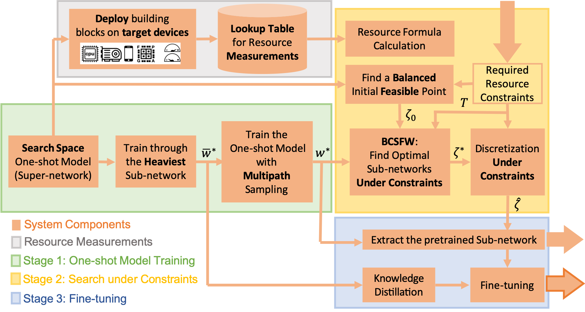
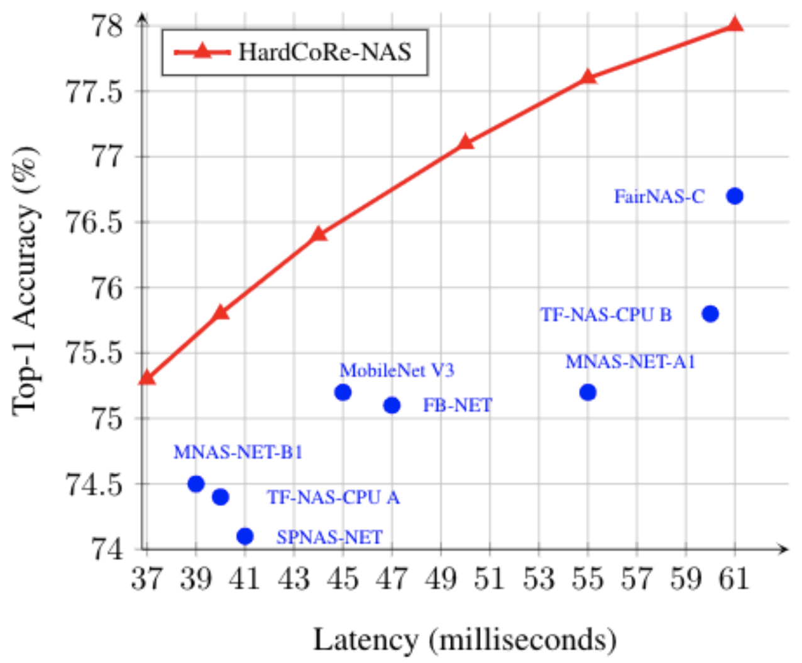
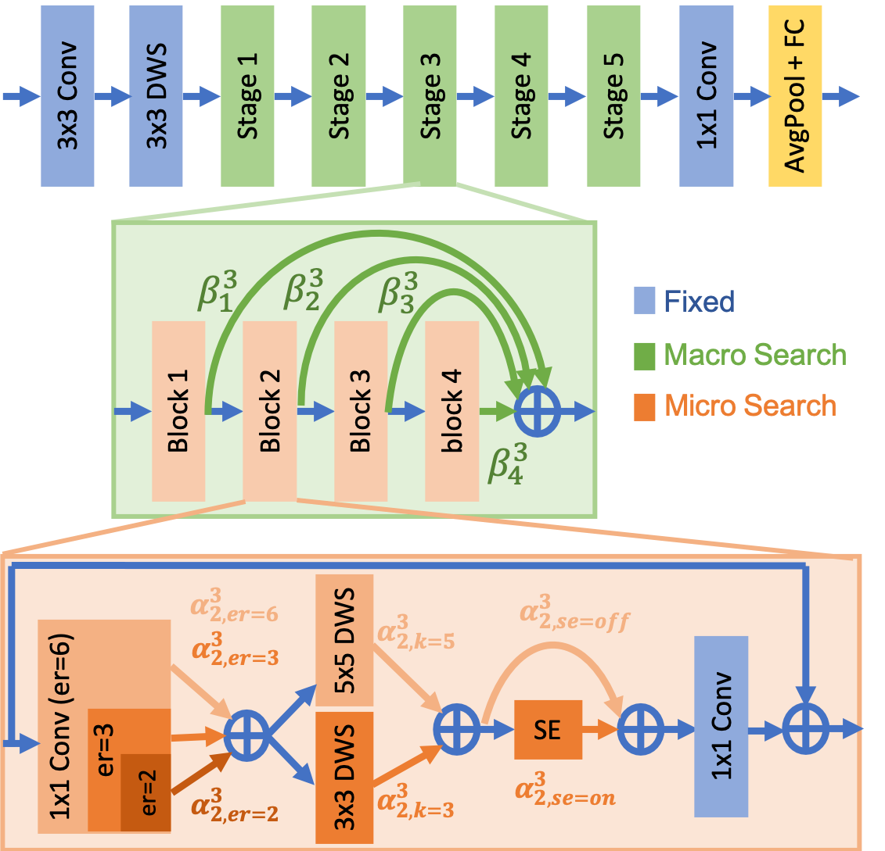
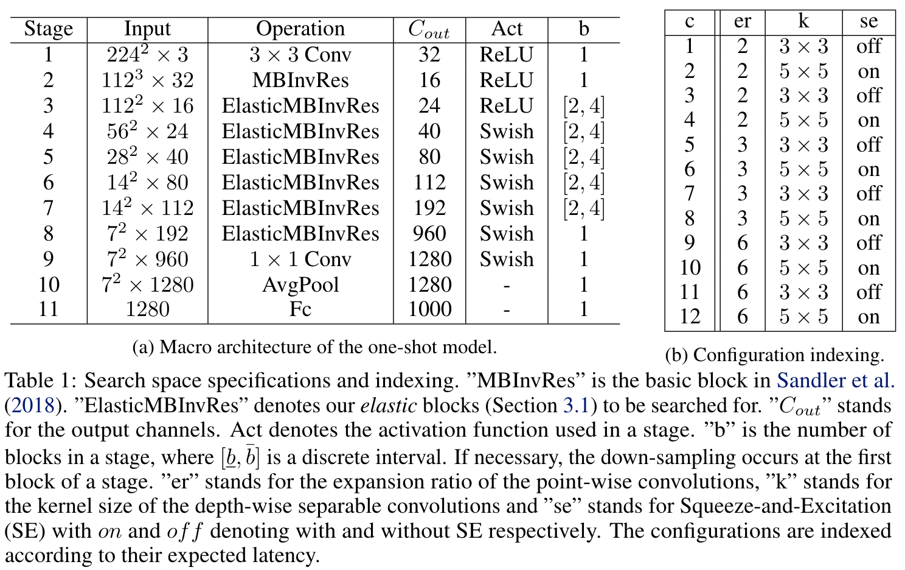
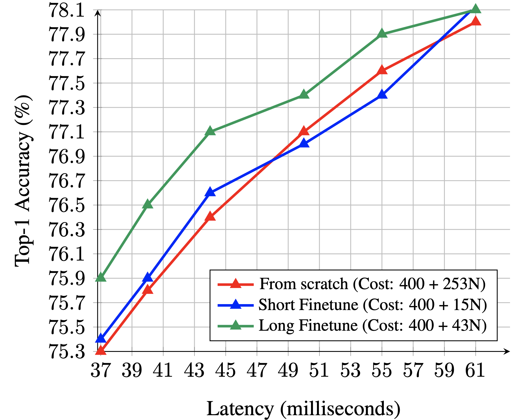

# HardCoRe-NAS: Hard Constrained diffeRentiable Neural Architecture Search

Code accompanying the paper:
> [HardCoRe-NAS: Hard Constrained diffeRentiable Neural Architecture Search](https://arxiv.org/abs/2102.11646)\
> Niv Nayman, Yonathan Aflalo, Asaf Noy, Lihi Zelnik-Manor.\
> _arXiv:2102.11646_.

Realistic use of neural networks often requires adhering to multiple constraints on latency, energy and memory among
others. A popular approach to find fitting networks is through constrained Neural Architecture Search (NAS), however,
previous methods enforce the constraint only softly. Therefore, the resulting networks do not exactly adhere to the
resource constraint and their accuracy is harmed. In this work we resolve this by introducing Hard Constrained
diffeRentiable NAS (HardCoRe-NAS), that is based on an accurate formulation of the expected resource requirement and a
scalable search method that satisfies the hard constraint throughout the search. Our experiments show that HardCoRe-NAS
generates state-of-the-art architectures, surpassing other NAS methods, while strictly satisfying the hard resource
constraints without any tuning required.

<p align="center">
    
    
</p>

## Requirements

Appear in [Docker/requirements.txt](Docker/requirements.txt)

For building a docker image:

```
docker build -f Docker/Dockerfile -t hardcore_nas .
```

### The Search Space

The search space is described in the following:

<p align="center">
    
    
</p>

A generated architecture is encoded in a string of the form:

```
"[['ds_r1_k3_s1_e1_c24_nre'], ['ir_r1_k5_s2_e3_c32_nre_se0.25', 'ir_r1_k5_s1_e6_c32_nre_se0.25'], ['ir_r1_k5_s2_e6_c48_nre_se0.25', 'ir_r1_k5_s1_e6_c48_nre_se0.25', 'ir_r1_k5_s1_e6_c48_nre_se0.25', 'ir_r1_k3_s1_e3_c48_nre_se0.25'], ['ir_r1_k5_s2_e6_c96_se0.25', 'ir_r1_k5_s1_e6_c96_se0.25', 'ir_r1_k3_s1_e3_c96_se0.25', 'ir_r1_k3_s1_e3_c96_se0.25'], ['ir_r1_k5_s1_e6_c136_se0.25', 'ir_r1_k3_s1_e6_c136_se0.25', 'ir_r1_k3_s1_e3_c136_se0.25', 'ir_r1_k5_s1_e3_c136_se0.25'], ['ir_r1_k5_s2_e6_c232_se0.25', 'ir_r1_k5_s1_e6_c232_se0.25'], ['cn_r1_k1_s1_c1152']]"
```

where,

```
ir = InvertedResidual, 
ds = DepthwiseSep, 
dsa = DeptwhiseSep with a point-wise convolution and an activation, 
cn = Convolusion with a batch normalization and an activation,
r - Number of repeat blocks,
k - Kernel size,
s - Strides (1-9),
e - Expansion ratio,
c - Output channels,
se - Squeeze and excitation ratio
n - Activation function ('re', 'r6', 'hs', or 'sw')
```

### Lookup Table (LUT) Generation:

```
python measure_latency_lut.py
--target_device=<The target device to measure latency on ('cpu', 'onnx', 'gpu')>
--lut_filename=<The full path to the latency LUT to be saved>
--lut_measure_batch_size=<The input batch size to measure latency with respect to>
--repeat_measure=<Number of measurements repetitions for each latency measurement>
```

We provide several precomputed lookup tables for:

* [Deployed with ONNX and measured on Intel Xeon CPU (batch size=1)](https://miil-public-eu.oss-eu-central-1.aliyuncs.com/public/HardCoReNAS/LUT_ONNX.pkl)
* [Deployed with PyTorch and measured on Intel Xeon CPU (batch size=1)](https://miil-public-eu.oss-eu-central-1.aliyuncs.com/public/HardCoReNAS/LUT_CPU.pkl)
* [Deployed with PyTorch and measured on NVIDIA P100 GPU (batch size=64)](https://miil-public-eu.oss-eu-central-1.aliyuncs.com/public/HardCoReNAS/LUT_GPU.pkl)

### Train the One-shot Model:

#### Train the heaviest model first:

```
python -u ./train.py
<Path to dataset>
-b=256
--heaviest_network
--lr=0.128
--sched=step
--epochs=300
--decay-epochs=2.4
--decay-rate=0.97
--warmup-lr=1e-6
--weight-decay=1e-5
--drop=0.3
--drop-path=0.2
```

We provide such an (upgraded)
output [checkpoint for download](https://miil-public-eu.oss-eu-central-1.aliyuncs.com/public/HardCoReNAS/w_heaviest_d89ee05d.pth)
.

#### Train the one-shot model with multipath sampling:

```
python -u ./train.py
<Path to dataset>
-b=200
--heaviest_network
--lr=0.0128
--sched=cosine
--epochs=100
--warmup-lr=1e-4
--weight-decay=1e-5
--train_elastic_model
--gamma_knowledge=1
--ikd_dividor=50
--hard_backprop
--real_KD
--initial-checkpoint_IKD=<A path to the one-shot model's weights, pretrained via the heaviest sub-network, it can also be an url>
```

We provide an
output [checkpoint for download](https://miil-public-eu.oss-eu-central-1.aliyuncs.com/public/HardCoReNAS/w_star_076b2ed3.pth)
.

### Search Under Latency Constraints:

```
python -u ./search.py
<Path to dataset>
--train_percent=80 
--bcfw_steps=10000
--initial-checkpoint=<A path to the one-shot model's weights>
--inference_time_limit=<The upper limit of the latency constraint (T)>
```

For loading a pre-measured latency LUT, add:

```
--lut_filename=<The full path to the pre-measured latency LUT to be loaded>
```

### Fine-tune

```
python -u ./train.py
<Path to dataset>
-b=128
--lr=0.00128
--sched=cosine
--epochs=50
--warmup-lr=1e-4
--weight-decay=1e-5
--transform_model_to_mobilenet
--model_IKD=mobilenasnet
--use_KD
--gamma_knowledge=2
--initial-checkpoint_IKD=<A path to the one-shot model's weights, pretrained via the heaviest sub-network, it can also be an url>
```

with either:

```
--initial-checkpoint=<A path to the one-shot model's weights at the end of the search>
```

or:

```
--mobilenet_string=<The string that encodes the generated architecture>
--initial-checkpoint=<A path to the generated model's weights, it can also be an url>
```

The output checkpoint is saved at: outputs/train/&lt;date&gt;-&lt;time&gt;-mobilenasnet-&lt;input
resolution&gt;/model_best.pth.tar

### Output Checkpoints

The output checkpoints are saved at:

```
outputs/train/<date>-<time>-mobilenasnet-<input resolution>/model_best.pth.tar
```

### Distributed Training

For applying distributed training of several GPU cores, replace ``python -u <Path to script>`` with:

```
python -u -m torch.distributed.launch --nproc_per_node=<Number of GPUs> --nnodes=1 --node_rank=0 <Path to script>
```

## Inference

```
python ./validate.py 
<Path to validation dataset>
-b=512
--mobilenet_string=<The string that encodes the generated architecture>
--checkpoint=<A path to the fine-tuned generated model's weights, it can also be an url>
```

### Reproducing the paper results

<p align="center">
    
</p>

Model | Latency | Red | Green | Blue | Trained with KD|
| :--------------: | :--------------: | :--------------: | :--------------: |  :--------------: | :--------------: |
| HardCoRe-NAS A | 38 ms | [75.3%](https://miil-public-eu.oss-eu-central-1.aliyuncs.com/public/HardCoReNAS/HardCoreNAS_A_Red_38ms_75.3_f18dfbf3.pth) | [75.9%](https://miil-public-eu.oss-eu-central-1.aliyuncs.com/public/HardCoReNAS/HardCoreNAS_A_Green_38ms_75.9_23474aeb.pth) | [75.4%](https://miil-public-eu.oss-eu-central-1.aliyuncs.com/public/HardCoReNAS/HardCoreNAS_A_Blue_38ms_75.4_4848d67c.pth) | [78.3](https://miil-public-eu.oss-eu-central-1.aliyuncs.com/public/HardCoReNAS/HardCoreNAS_A_KD_38ms_78.3_664b93e5.pth) |
| HardCoRe-NAS B | 40 ms | [75.8%](https://miil-public-eu.oss-eu-central-1.aliyuncs.com/public/HardCoReNAS/HardCoreNAS_B_Red_40ms_75.8_b810030e.pth) | [76.5%](https://miil-public-eu.oss-eu-central-1.aliyuncs.com/public/HardCoReNAS/HardCoreNAS_B_Green_40ms_76.5_1f882d1e.pth) | [75.9%](https://miil-public-eu.oss-eu-central-1.aliyuncs.com/public/HardCoReNAS/HardCoreNAS_B_Blue_40ms_75.9_8c2193e3.pth) | [78.8](https://miil-public-eu.oss-eu-central-1.aliyuncs.com/public/HardCoReNAS/HardCoreNAS_B_KD_40ms_78.8_d99a43aa.pth) |
| HardCoRe-NAS C | 44 ms | [76.4%](https://miil-public-eu.oss-eu-central-1.aliyuncs.com/public/HardCoReNAS/HardCoreNAS_C_Red_44ms_76.4_61770b8a.pth) | [77.1%](https://miil-public-eu.oss-eu-central-1.aliyuncs.com/public/HardCoReNAS/HardCoreNAS_C_Green_44ms_77.1_d4148c9e.pth) | [76.6%](https://miil-public-eu.oss-eu-central-1.aliyuncs.com/public/HardCoReNAS/HardCoreNAS_C_Blue_44ms_76.6_63b3e69c.pth) | [78.9](https://miil-public-eu.oss-eu-central-1.aliyuncs.com/public/HardCoReNAS/HardCoreNAS_C_KD_44ms_78.9_48df9cfa.pth) |
| HardCoRe-NAS D | 50 ms | [77.1%](https://miil-public-eu.oss-eu-central-1.aliyuncs.com/public/HardCoReNAS/HardCoreNAS_D_Red_50ms_77.1_2d24d8a4.pth) | [77.4%](https://miil-public-eu.oss-eu-central-1.aliyuncs.com/public/HardCoReNAS/HardCoreNAS_D_Green_50ms_77.4_23e3cdde.pth) | [77.0%](https://miil-public-eu.oss-eu-central-1.aliyuncs.com/public/HardCoReNAS/HardCoreNAS_D_Blue_50ms_77.0_4098412f.pth) | [79.5](https://miil-public-eu.oss-eu-central-1.aliyuncs.com/public/HardCoReNAS/HardCoreNAS_D_KD_50ms_79.5_8f1eb662.pth) |
| HardCoRe-NAS E | 55 ms | [77.6%](https://miil-public-eu.oss-eu-central-1.aliyuncs.com/public/HardCoReNAS/HardCoreNAS_E_Red_55ms_77.6_305bd2a1.pth) | [77.9%](https://miil-public-eu.oss-eu-central-1.aliyuncs.com/public/HardCoReNAS/HardCoreNAS_E_Green_55ms_77.9_90f20e8a.pth) | [77.4%](https://miil-public-eu.oss-eu-central-1.aliyuncs.com/public/HardCoReNAS/HardCoreNAS_E_Blue_55ms_77.4_828a424a.pth) | [80.1](https://miil-public-eu.oss-eu-central-1.aliyuncs.com/public/HardCoReNAS/HardCoreNAS_E_KD_55ms_80.1_c176b248.pth) |
| HardCoRe-NAS F | 60 ms | [78.0%](https://miil-public-eu.oss-eu-central-1.aliyuncs.com/public/HardCoReNAS/HardCoreNAS_F_Red_60ms_78.0_84d379f6.pth) | [78.1%](https://miil-public-eu.oss-eu-central-1.aliyuncs.com/public/HardCoReNAS/HardCoreNAS_F_Green_60ms_78.1_2855edf1.pth) | [78.1%](https://miil-public-eu.oss-eu-central-1.aliyuncs.com/public/HardCoReNAS/HardCoreNAS_F_Blue_60ms_78.1_8b7407ef.pth) | - |

* The latency is reported for Intel Xeon CPU running with a batch size of 1.
* The links to the models provided in the table can be used via the ``--checkpoint`` argument

HardCoRe-NAS A:

```
[['ds_r1_k3_s1_e1_c16_nre'], ['ir_r1_k5_s2_e3_c24_nre', 'ir_r1_k5_s1_e3_c24_nre_se0.25'], ['ir_r1_k5_s2_e3_c40_nre', 'ir_r1_k5_s1_e6_c40_nre_se0.25'], ['ir_r1_k5_s2_e6_c80_se0.25', 'ir_r1_k5_s1_e6_c80_se0.25'], ['ir_r1_k5_s1_e6_c112_se0.25', 'ir_r1_k5_s1_e6_c112_se0.25'], ['ir_r1_k5_s2_e6_c192_se0.25', 'ir_r1_k5_s1_e6_c192_se0.25'], ['cn_r1_k1_s1_c960']]
```

HardCoRe-NAS B:

```
[['ds_r1_k3_s1_e1_c16_nre'], ['ir_r1_k5_s2_e3_c24_nre', 'ir_r1_k5_s1_e3_c24_nre_se0.25', 'ir_r1_k3_s1_e3_c24_nre'], ['ir_r1_k5_s2_e3_c40_nre', 'ir_r1_k5_s1_e3_c40_nre', 'ir_r1_k5_s1_e3_c40_nre'], ['ir_r1_k5_s2_e3_c80', 'ir_r1_k5_s1_e3_c80', 'ir_r1_k3_s1_e3_c80', 'ir_r1_k3_s1_e3_c80'], ['ir_r1_k5_s1_e3_c112', 'ir_r1_k3_s1_e3_c112', 'ir_r1_k3_s1_e3_c112', 'ir_r1_k3_s1_e3_c112'], ['ir_r1_k5_s2_e6_c192_se0.25', 'ir_r1_k5_s1_e6_c192_se0.25', 'ir_r1_k3_s1_e3_c192_se0.25'], ['cn_r1_k1_s1_c960']]
```

HardCoRe-NAS C:

```
[['ds_r1_k3_s1_e1_c16_nre'], ['ir_r1_k5_s2_e3_c24_nre', 'ir_r1_k5_s1_e3_c24_nre_se0.25'], ['ir_r1_k5_s2_e3_c40_nre', 'ir_r1_k5_s1_e3_c40_nre', 'ir_r1_k5_s1_e3_c40_nre', 'ir_r1_k5_s1_e3_c40_nre'], ['ir_r1_k5_s2_e4_c80', 'ir_r1_k5_s1_e6_c80_se0.25', 'ir_r1_k3_s1_e3_c80', 'ir_r1_k3_s1_e3_c80'], ['ir_r1_k5_s1_e6_c112_se0.25', 'ir_r1_k3_s1_e3_c112', 'ir_r1_k3_s1_e3_c112', 'ir_r1_k3_s1_e3_c112'], ['ir_r1_k5_s2_e6_c192_se0.25', 'ir_r1_k5_s1_e6_c192_se0.25', 'ir_r1_k3_s1_e3_c192_se0.25'], ['cn_r1_k1_s1_c960']]
```

HardCoRe-NAS D:

```
[['ds_r1_k3_s1_e1_c16_nre'], ['ir_r1_k5_s2_e3_c24_nre_se0.25', 'ir_r1_k5_s1_e3_c24_nre_se0.25'], ['ir_r1_k5_s2_e3_c40_nre_se0.25', 'ir_r1_k5_s1_e4_c40_nre_se0.25', 'ir_r1_k3_s1_e3_c40_nre_se0.25'], ['ir_r1_k5_s2_e4_c80_se0.25', 'ir_r1_k3_s1_e3_c80_se0.25', 'ir_r1_k3_s1_e3_c80_se0.25', 'ir_r1_k3_s1_e3_c80_se0.25'], ['ir_r1_k3_s1_e4_c112_se0.25', 'ir_r1_k5_s1_e4_c112_se0.25', 'ir_r1_k3_s1_e3_c112_se0.25', 'ir_r1_k5_s1_e3_c112_se0.25'], ['ir_r1_k5_s2_e6_c192_se0.25', 'ir_r1_k5_s1_e6_c192_se0.25', 'ir_r1_k5_s1_e6_c192_se0.25', 'ir_r1_k3_s1_e6_c192_se0.25'], ['cn_r1_k1_s1_c960']]
```

HardCoRe-NAS E:

```
[['ds_r1_k3_s1_e1_c16_nre'], ['ir_r1_k5_s2_e3_c24_nre_se0.25', 'ir_r1_k5_s1_e3_c24_nre_se0.25'], ['ir_r1_k5_s2_e6_c40_nre_se0.25', 'ir_r1_k5_s1_e4_c40_nre_se0.25', 'ir_r1_k5_s1_e4_c40_nre_se0.25', 'ir_r1_k3_s1_e3_c40_nre_se0.25'], ['ir_r1_k5_s2_e4_c80_se0.25', 'ir_r1_k3_s1_e6_c80_se0.25'], ['ir_r1_k5_s1_e6_c112_se0.25', 'ir_r1_k5_s1_e6_c112_se0.25', 'ir_r1_k5_s1_e6_c112_se0.25', 'ir_r1_k5_s1_e3_c112_se0.25'], ['ir_r1_k5_s2_e6_c192_se0.25', 'ir_r1_k5_s1_e6_c192_se0.25', 'ir_r1_k5_s1_e6_c192_se0.25', 'ir_r1_k3_s1_e6_c192_se0.25'], ['cn_r1_k1_s1_c960']]
```

HardCoRe-NAS F:

```
[['ds_r1_k3_s1_e1_c16_nre'], ['ir_r1_k5_s2_e3_c24_nre_se0.25', 'ir_r1_k5_s1_e3_c24_nre_se0.25'], ['ir_r1_k5_s2_e6_c40_nre_se0.25', 'ir_r1_k5_s1_e6_c40_nre_se0.25'], ['ir_r1_k5_s2_e6_c80_se0.25', 'ir_r1_k5_s1_e6_c80_se0.25', 'ir_r1_k3_s1_e3_c80_se0.25', 'ir_r1_k3_s1_e3_c80_se0.25'], ['ir_r1_k3_s1_e6_c112_se0.25', 'ir_r1_k5_s1_e6_c112_se0.25', 'ir_r1_k5_s1_e6_c112_se0.25', 'ir_r1_k3_s1_e3_c112_se0.25'], ['ir_r1_k5_s2_e6_c192_se0.25', 'ir_r1_k5_s1_e6_c192_se0.25', 'ir_r1_k3_s1_e6_c192_se0.25', 'ir_r1_k3_s1_e6_c192_se0.25'], ['cn_r1_k1_s1_c960']]
```

## Citation

If you use any part of this code in your research, please cite our [paper](https://arxiv.org/abs/2102.11646):

```
@misc{nayman2021hardcorenas,
      title={HardCoRe-NAS: Hard Constrained diffeRentiable Neural Architecture Search},
      author={Niv Nayman and Yonathan Aflalo and Asaf Noy and Lihi Zelnik-Manor},
      year={2021},
      eprint={https://arxiv.org/abs/2102.11646},
      archivePrefix={arXiv},
      primaryClass={cs.LG}
}
```

## Acknowledgements

We thank Hussam Lawen for assistance with deployment practices and Matan Protter and Avi Ben Cohen for discussions and
comments.

Many supporting components of this code implementation are adapted from the excellent
[repository of Ross Wightman](https://github.com/rwightman/pytorch-image-models). Check it out and give it a star while
you are at it.
